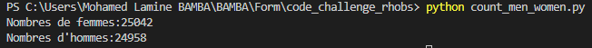
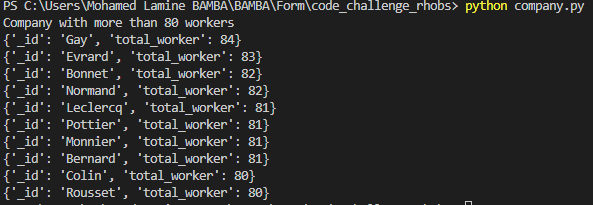
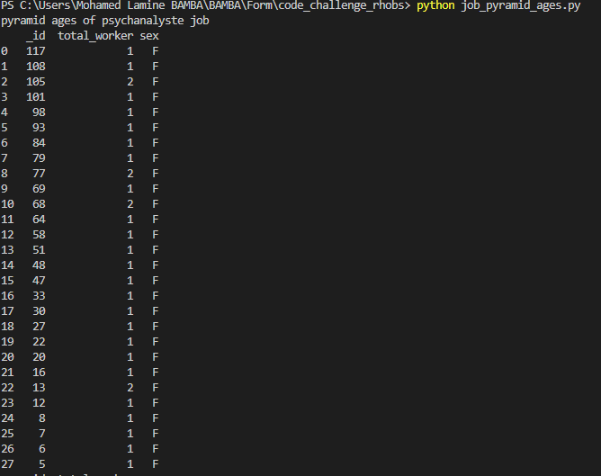
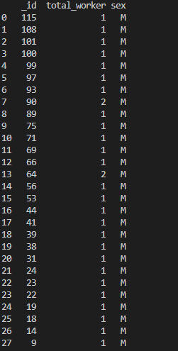
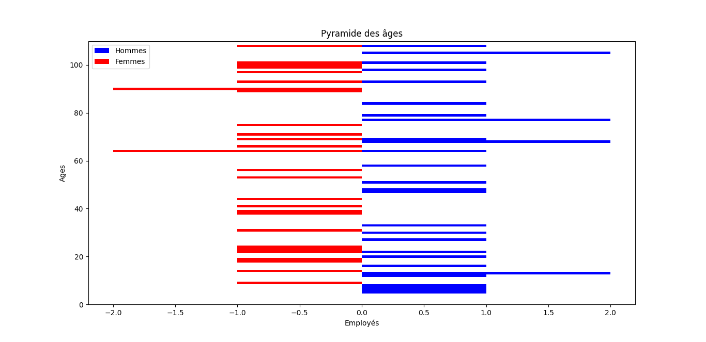

# rhobs_code_challenge

## Functions

1. Compte le nombre de femmes / d'hommes.
   `count_men_women.py`
2. Renvoie les entreprises de plus de N personnes.  
 `company.py`

4.  Prend en paramètre un métier et qui renvoie la pyramide des âges pour ce métier.

 `job_pyramid_ages.py`

## Output
1.  Compter le nombre de femmes / d'hommes.
  

2. Écrire une fonction qui renvoie les entreprises de plus de N personnes.

3.  Écrire une fonction qui prend en paramètre un métier et qui renvoie la pyramide des âges pour ce métier.
Note:`_id` is the age

